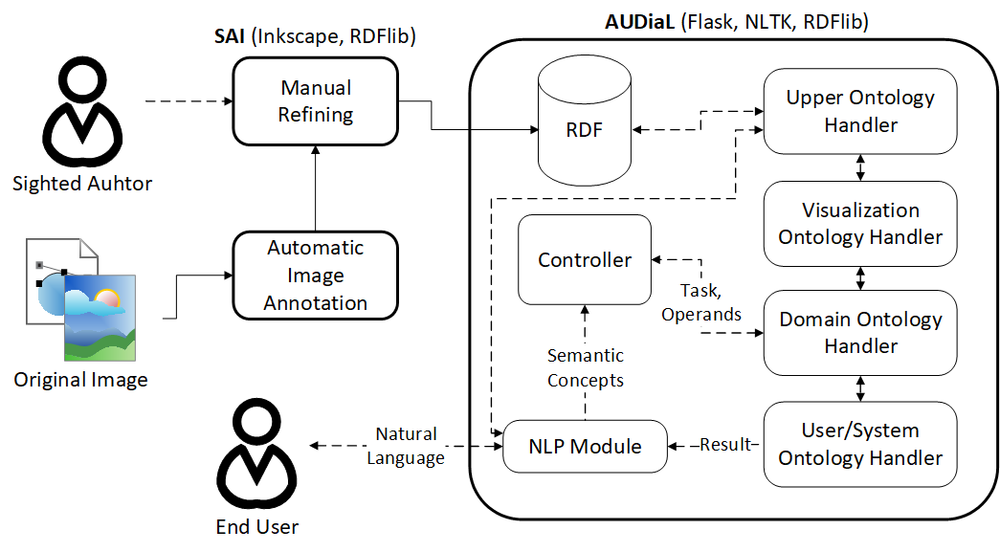

# AUDiaL

**A**ccessible **U**niversal **Dia**grams through **L**anguage
 
A Web-based Natural Language Interface (NLI) to semantically-enhanced diagrams in RDF. Built with [Flask](http://flask.pocoo.org/), [NLTK](https://www.nltk.org/), the [Stanford Parser](https://nlp.stanford.edu/software/lex-parser.shtml), and [RDFLib](https://rdflib.readthedocs.io). Code for initial NLP and dialogue handling derived from [FREyA](https://sites.google.com/site/naturallanguageinterfaces/freya).

## About

This repository contains the Web application prototype employed for the evaluation of a NLI to diagrams as an advanced alternative to traditional tactile and tabular accessible versions thereof.

The block diagram above outlines the most relevant components of the proposed framework of NLI to graphics AUDiaL belongs to. Namely:

* A formal mapping of visualization semantics from graphic primitives to ontological resources
* Ontologically-supported Natural Language Processing (NLP) that maps phrases found within a user's query in natural language to Semantic Concepts
* Domain-dependant task handling on diagrams
* User-specific annotation techniques allowing for partial compesation of the loss of cognitive benefits derived from the lack of sight
* Output of task result to the user in natural language
* An accessible Web-based User Interface allowing blind users to access the prototype in an efficient manner

## Install

Please follow the [installation instructions](docs/install/INSTALL.md).

## Usage
- Run locally:
  - `python path/to/project/__init__.py`
  - Visit `127.0.0.1:54634`
  
- Debug with PyDev:
  - `python "path\to\pydev\pydevd.py" --multiproc --qt-support=auto --client 127.0.0.1 --port 54634 --file path/to/project/__init__.py`